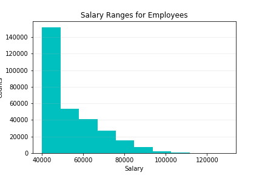
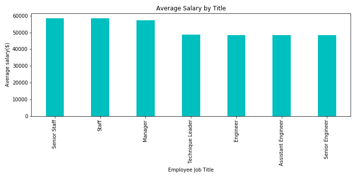

# SQL Homework - Employee Database: A Mystery in Two Parts

## Background

In this assignment, 6 CSV files were provided-
1. Employees - employee info
2. salaries - employees' salaries within a time period (from_date - to_date)
3. titles - employees' titles within the time period (from_date - to_date)
4. departments - department id and name
5. dept_emp - employee's change in department within the time period  (from_date - to_date)
6. dept_managers - department's  change in manager within the time period  (from_date - to_date)

Inspecting the data in these CSV files, the following aspects were designed -

#### Data Modeling

#### Data Engineering

* Created a table schema for each of the six CSV files, in accordance with the data model.

#### Data Analysis

Following questions were answered -

1. Details of each employee: employee number, last name, first name, gender, and salary.

2. Employees who were hired in 1986.

3. Manager of each department.

4. Department of each employee.

5. Employees whose first name is "Hercules" and last names begin with "B."

6. All employees in the Sales department.

7. All employees in the Sales and Development departments.

8. How many employees share each last name.

#### Further Analysis

1. Imported the SQL database into Pandas.

2. Created a histogram to visualize the most common salary ranges for employees.

3. Created a bar chart of average salary by title.

